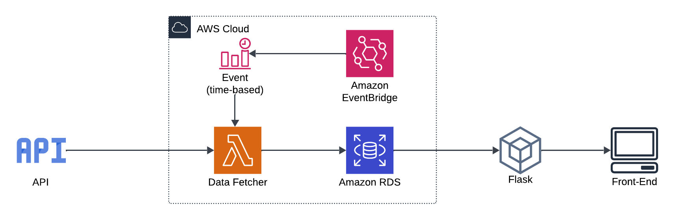
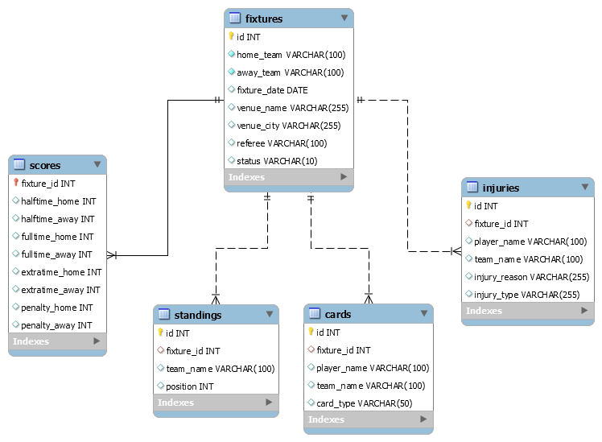

# ⚽ DataFut

DataFut é uma aplicação para coletar e processar dados de futebol da UEFA Champions League (ou demais ligas, basta mudar o parâmetro no código), utilizando a API: API-FOOTBALL (Disponível no Rapid-API).

O código utiliza de funções como Amazon RDS para armazenar os dados e AWS Lambda para executar as tarefas de coleta e processamento de dados com uma rotina diária de forma remota, e o framework Flask para construir a interface web, até o momento armazenada localmente.

## 🚀 Funcionalidades

- Coleta de dados de partidas (fixtures)
- Atualização de classificações (standings)
- Registro de resultados de jogos
- Rastreamento de cartões amarelos e vermelhos
- Monitoramento de lesões de jogadores

## 🛠 Tecnologias Utilizadas

- Python
- Flask (com HTML, CSS & JavaScript)
- AWS RDS (Mysql)
- AWS Lambda
- AWS EventBridge
- API-Football

## 📊 Estrutura do Projeto

O projeto está organizado em módulos:

- `data_fetchers/`: Módulos para buscar dados da API
- `database/services/`: Serviços para interação com o banco de dados
- `lambda_handler.py`: Função lambda a ser inserida no console AWS
- `app.py`: Interface web Flask para visualizar os dados coletados
- `main.py`: Pode ser usada para testar o código localmente, tem o mesmo conteúdo da lambda, porém com depuração.

### 🌟 Arquitetura

### 🗄️ Mapa Relacional do Banco de Dados

## 🔍 Como Funciona

1. A função Lambda é acionada diariamente pelo EventBridge
2. Busca fixtures (partidas) da UEFA Champions League
3. Para cada fixture:
   - Verifica se já existe no banco de dados
   - Se não existir, insere os dados da fixture
   - Se existir:
     - Atualiza as classificações das equipes
     - Insere os resultados (se a partida já foi jogada)
     - Registra cartões dados durante a partida
     - Registra lesões de jogadores
   - Salva os dados no banco de dados
4. Envia os dados coletados para a interface web Flask
5. A interface web Flask é executada localmente para visualizar os dados coletados

## 🚀 Como Usar

1. Clone o repositório
2. Instale as dependências em requeriments.txt
3. Crie seu banco de dados MySQL
4. Configure suas variáveis de ambiente (assim como no .env.example) no console AWS 
5. Faça o deploy da função Lambda
6. Configure o gatilho para a função Lambda (por exemplo, um evento programado no CloudWatch)

## 🔧 Configuração

Atualmente, o projeto está configurado para a UEFA Champions League (LEAGUE_ID = "2") e para a temporada 2024 (SEASON = "2024"). 

(Isso pode ser alterado para outras ligas ou temporadas alterando os parâmetros no código.)

## 🤝 Contribuindo

Contribuições são bem-vindas! Sinta-se à vontade para abrir issues ou enviar pull requests.

## 📝 Licença

MIT License © 2024 Matheus Corniani, DataFut.

---

Desenvolvido com ❤️ por Matheus Corniani